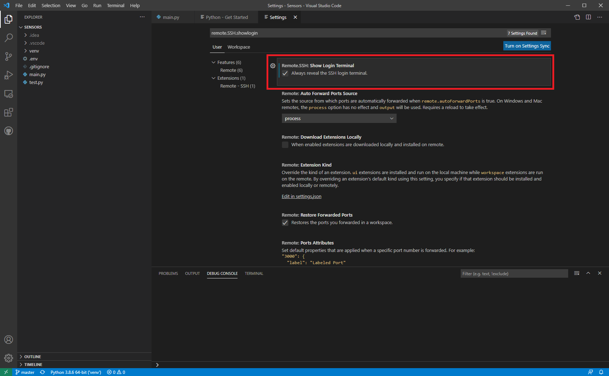

# How to use VS Code to remotely run and debug your Raspberry Pi applications.

As I have begun my journey with the Raspberry Pi and electronic circuits, I have encountered one very annoying problem.
My main Windows computer is a powerhouse, so I want to do all my coding on it for ease of use, but I need to code on my Raspberry Pi to use its GPIO interface.

As a quick, slapped together solution I have simply opened a file share on my Windows computer and manually copied updated scripts via SSH. This is obviously a very tedious process and I have finally reached the point where I decided I need a better solution.  

Initially I Googled around to figure out which IDEs supported running and debugging your code on a remote machine and was happy to find that many did so. Of note, I discovered that PyCharm, the IDE I have historically preferred for Python development, has such an offering but it is limited only to users who pay for a professional license. I had no desire to pay ~$90 a year just to get this functionality, so my search continued until I discovered VS Code's 'Remote - SSH' extension. This extension allows you to connect to a remote host via SSH and work with the files located on that machine, no local files are needed. Perhaps most important for me, this extension is *free* and will work with various languages! So let's run through how to get this environment all set up so you (and I!) can get back to working on our projects.  

This VS Code extension requires that your Pi's CPU is of the ARMv7 architecture or newer. This means that some older models are *not* supported.

**Supported Models of Raspberry Pi**

- Raspberry Pi 4
- Compute Module 4
- Raspberry Pi 400
- Raspberry Pi 3
- Raspberry Pi 2

**Unsupported Models of Raspberry Pi**
- Raspberry Pi 1
- Compute Module 1
- Raspberry Pi Zero

## Getting Started
1. Obviously, we need to install VS Code. You can do so [here](https://code.visualstudio.com/docs/remote/troubleshooting#_installing-a-supported-ssh-client).

2. VS Code requires you to install an extension to get Python support, so download that [here](https://marketplace.visualstudio.com/items?itemName=ms-python.python). (Additionally, make sure that you enable linting to get syntax corrections)

3. Now that we have our IDE set up with Python enabled, we need to download the aforementioned Remote - SSH extension. Grab it from [this page](https://marketplace.visualstudio.com/items?itemName=ms-vscode-remote.remote-ssh). Alternatively, you could install the overarching [Remote Development](https://marketplace.visualstudio.com/items?itemName=ms-vscode-remote.vscode-remote-extensionpack) extension that includes additional support for containers and WSL.

3. Go to VS Code settings, search for remote.SSH.showlogin and enable the option to always reveal te SSH login terminal. This may save you a lot of headaches if your SSH sessions never connect, it may actually be waiting for you to accept the machines fingerprint in the console if this is your first time connecting to it.



<!--- 4. Windows runs an outdated version of ssh-agent by default that makes it impossible to connect without first manually updating it. So, we must download the updated version from GitHub [here](https://github.com/PowerShell/Win32-OpenSSH/releases), extract that file, then run the install-sshd.ps1 PowerShell script. (I am seriously starting to hate Windows because of stuff like this) --->

5. Now it is time to set up a SSH connection. We must generate a new SSH key and copy it over to our remote host.
  - Open a new PowerShell terminal as administrator.
  - If you do not already have a key you want to use run ```ssh-keygen -t rsa -b 4096```, enter the name for your key if desired, and optionally, a passphrase.
  - Next we will set up a couple of variables to make sending the public key to our Raspberry Pi a little bit easier. Enter ```$USER_AT_HOST="your-user-name-on-host@hostname"``` and ```$PUBKEYPATH="$HOME\.ssh\id_rsa.pub"``` with your respective username, hostname, and path to your public key. (Likely ~/.ssh/id_rsa.pub if you used the defaults above)
  - Next we will send the public key to the remote host with the command ```$pubKey=(Get-Content "$PUBKEYPATH" | Out-String); ssh "$USER_AT_HOST" "mkdir -p ~/.ssh && chmod 700 ~/.ssh && echo '${pubKey}' >> ~/.ssh/authorized_keys && chmod 600 ~/.ssh/authorized_keys"```
  - Now we must ensure that the Windows OpenSSH Authentication Agent service is running. In the same elevated Powershell window run the command ```Set-Service ssh-agent -StartupType Automatic``` to enable the agent, run ```Start-Service ssh-agent``` to start it, then run ```Get-Service ssh-agent``` to double check that it started correctly and is running.
  - Finally, add your public key to the SSH Agent by running ```ssh-add ~\.ssh\NAME_OF_YOUR_KEY```. You will not be able to authenticate to your remote computer without these last two steps.

6. Now everything should be set up. Let's try connecting to our Raspberry Pi by clicking the little green connection button at the bottom left of the VS Code window and selecting the option to connect the current window to a host.

7. Type in the details to connect to your host, in the format username@hostname. These should be the same as the information you entered when we created that $USER_AT_HOST variable earlier. In my case it is ubuntu@masternode.

8. If successful, there should not be any error messages and it should display the name of the server you are shelled into at the bottom left in the green box. As another check, you can hit the + symbol at the top right of the terminal pane to open a new terminal and you should see that you are logged into the remote server.

9. Now try creating and running a script! I created a new directory called PythonDev on my remote machine and created a quick "Hello World!" script. As a note, you need to install the Python extension on the remote server as well if you want syntax highlighting, etc.

That's it! Now you can do all of your development on a remote server, like a Raspberry Pi in my case, while sitting comfortably at your main workstation without having to fuss about with file sharing or pushing/pulling from Git over and over.

## Credits
This guide is mostly summarized/simplified information from the official documentation on the VS Code Remote - SSH extension located [here](https://code.visualstudio.com/docs/remote/troubleshooting#_installing-a-supported-ssh-client), [here](https://code.visualstudio.com/docs/remote/ssh-tutorial), and [here](https://code.visualstudio.com/docs/remote/ssh).
